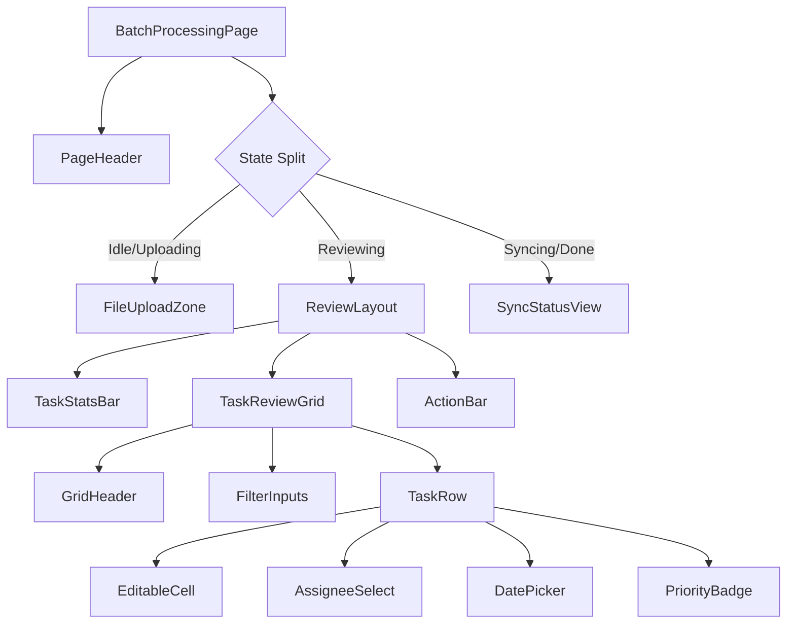

# Frontend Architecture Plan - Module A: Batch Processing

> **Phase:** 1 - Backend Verified, Moving to Frontend
> **Goal:** Implement "File Upload & Task Review" workflow.

## 1. Executive Summary

This document outlines the frontend architecture for the **Batch Processing** feature. The goal is to replace the Streamlit `st.data_editor` workflow with a React-based solution using **TanStack Table** for the "Review Grid" and **Zustand** for state management. This ensures a responsive, type-safe, and editable interface for managing tasks before syncing to Vikunja.

---

## 2. Component Hierarchy

The UI will be structured as a tree of components, centered around the `BatchProcessingPage`.



### Component Roles:
*   **`BatchProcessingPage`**: Top-level container. Orchestrates view switching based on store state (`idle`, `reviewing`, `syncing`).
*   **`FileUploadZone`**: Handles drag-and-drop or click-to-upload. Triggers the `/analyze` API call.
*   **`TaskReviewGrid`**: The core interactive component.
    *   **Libraries**: `@tanstack/react-table`, `shadcn/ui` (Table, Input, Select, Popover, Calendar).
    *   **Features**: Sorting, Filtering, and **Inline Editing**.
*   **`TaskStatsBar`**: Shows summary metrics (e.g., "5 Tasks Identified", "Total Est. Tokens: 120").
*   **`ActionBar`**: Contains "Sync to Vikunja", "Clear All", and "Add Manual Task" buttons.

---

## 3. State Management Strategy

We will use **Zustand** for managing the application state. Zustand is chosen over Redux (too boilerplate) and Context (performance issues with frequent grid updates) because it offers a simple hook-based API and transient updates.

### Store: `useBatchStore`

```typescript
type AppState = {
  status: 'idle' | 'uploading' | 'analyzing' | 'reviewing' | 'syncing' | 'completed' | 'error';
  tasks: Task[]; // The "Draft" tasks
  syncResult: SyncSummary | null;
  error: string | null;
  
  // Actions
  uploadFiles: (files: File[]) => Promise<void>;
  updateTask: (index: number, updates: Partial<Task>) => void;
  removeTask: (index: number) => void;
  syncToVikunja: () => Promise<void>;
  reset: () => void;
}
```

*   **Logic Location**: All API calls (`analyze`, `sync`) will reside within the Zustand actions, keeping components clean.
*   **draft Tasks**: The `tasks` array is the "Single Source of Truth" for the Review Grid. Editing a cell updates this array directly.

---

## 4. Type Definitions

These interfaces must strictly match the verified Backend API and Pydantic models.

```typescript
// Matches TaskBase from backend/app/models/schemas.py
export interface Task {
  title: string;
  description: string | null;
  assignee_name: string | null; // Raw extracted name
  assignee_id: number | null;   // Resolved Vikunja User ID
  priority: number;             // 1-5
  due_date: string | null;      // ISO Date "YYYY-MM-DD"
}

// Matches AnalysisResponse
export interface AnalysisResponse {
  tasks: Task[];
  token_count: number;
  processing_time: number;
}

// Matches Vikunja Sync Response
export interface SyncDetail {
  title: string;
  status: 'success' | 'error';
  error?: string;
}

export interface SyncResponse {
  total: number;
  success: number;
  failed: number;
  details: SyncDetail[];
}
```

---

## 5. Library Selection

Confirmed choices based on requirements and compatibility.

| Category | Selection | Rationale |
| :--- | :--- | :--- |
| **HTTP Client** | **Axios** | Stronger typing support, interceptors (useful for future auth/tokens), and better error handling than native `fetch`. |
| **Data Grid** | **TanStack Table** | The industry standard for "Headless" tables. It integrates perfectly with `shadcn/ui` components (unlike creating a custom map which gets messy with sorting/filtering). Essential for the "Review" capability. |
| **UI Components** | **shadcn/ui** | Requested in Readiness Report. Provides high-quality, accessible primitives (Radix UI) compliant with modern design. |
| **Icons** | **Lucide React** | Standard companion to shadcn/ui. |
| **Date Handling** | **date-fns** | Lightweight, immutable date utility library (needed for date pickers). |
| **Schema Validation**| **Zod** | For frontend form validation if we add "Add Manual Task" forms (matches strict backend typing). |

---

## 6. Implementation Plan (Next Steps)

1.  **Setup**: Initialize `frontend` directory with Vite + React + TypeScript.
2.  **Dependencies**: Install `axios`, `zustand`, `@tanstack/react-table`, `shadcn-ui`.
3.  **API Layer**: Create `src/api/client.ts` and `src/api/batch.ts`.
4.  **Store**: Implement `src/store/useBatchStore.ts`.
5.  **Components**: Build `TaskReviewGrid` iteratively (Start with Read-only, then add Edit).
6.  **Integration**: Connect `BatchProcessingPage` to the Store and real Backend APIs.
